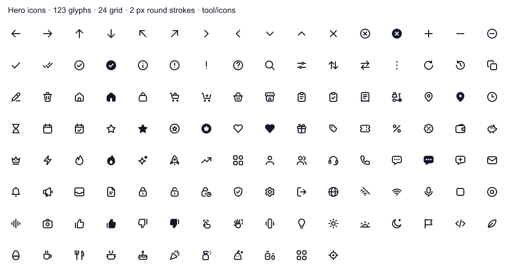
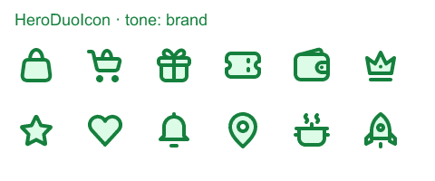
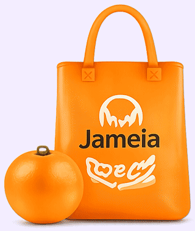
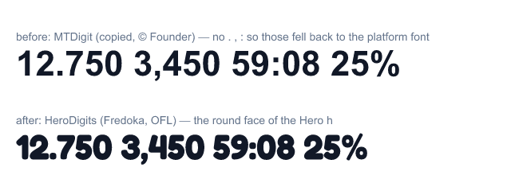

# Hero icons & assets 2026

This doc covers the review of every icon, font and bitmap in the app, the platform and package icons, and what replaced them. It was written on 2026-09-30.

The user decided:
- Replace the **full** icon set with Hero's own.
- Replace the price digits font with **Fredoka**.
- Use **official brand marks**, plus a drawn Kuwait flag.
- Icons take the **app's own colours**, including a two-tone option.
- Recolour the Pro bag to brand green with the Hero name.

Previews live in [`previews/`](previews/):

| Preview | What it shows |
|---|---|
|  | All 123 drawn glyphs at 24 dp |
|  | `HeroIcon(tone:)` in six tones |
|  | Pro bag: old Jameia print → Hero |
|  | Price digits: MTDigit → HeroDigits |

## 1. What the audit found

| Area | Finding | Result |
|---|---|---|
| Material icons | 158 names, about 405 uses. They mixed 3 styles (254 `_rounded`, 81 `_outlined`, the rest filled), and one idea often had 3–4 drawings (back, cart, location, star, delivery) | Replaced by the Hero set |
| `wm_c_iconfont.ttf` (`HeroIcon`) | Meituan/KeeTa icon font copied from the APK: 94 glyphs, 28 declared, about 95 uses. `favorite` drew a star | Deleted |
| `Hero-*.otf` | Its family name was really "KeeTa" (© Founder). It held only 3 glyphs, so the text was already drawn in Noto Sans | Deleted; Noto Sans is the body face |
| `MTDigitalDisplayKT-*` (`MTDigit`) | KeeTa's price digits (© Founder). No `.` `,` `:`, so those fell back to the platform font | Replaced by HeroDigits (Fredoka) |
| `market_image.png` | The Pro dome bag still printed the old **"Jameia"** logo | Now `hero_bag.png` |
| `icon_global_rider_*.png` | 42 px, KeeTa green, blurry | Now the Hero `delivery` glyph (two-tone) |
| `icon_fall_sky_close_*.png` | The popup close button, copied from the APK | Now the Hero `close` glyph |
| `login_icon_{google,apple,facebook}_*.png` | Copied from the APK | Now official marks from each owner's kit |
| About social tiles | Material stand-ins: `facebook_rounded`, a camera for Instagram, `@` for X | Now official marks |
| 🔥 (sale titles) and 🇰🇼 (phone prefix) | Emoji used as art look different on every OS. The flag string lived in the domain layer | Hero `flameFill` glyph and a drawn flag SVG |
| 3 SVGs off the palette | `checkout_points` #F59E0B, `checkout_wallet` #D97706, `offer_voucher` #374151 | → #F99022 / #E07D12 / #1F2937 |
| OFL fonts | No `LicenseRegistry` entry: the licences didn't travel with the fonts | `FontLicenses.register()` |

### Platform and package icons

| Where | Status |
|---|---|
| Android launcher: adaptive (bg + fg), monochrome (Android 13 themed), Android 12 splash (+ night) | Hero mark ✓ (flutter_launcher_icons from `tool/splash`) |
| iOS AppIcon (light, dark, tinted), web favicon + PWA icons | Hero mark ✓. The favicon is soft at 16 px (minor) |
| Notification small icon | **None yet.** It needs a white-only `ic_stat_hero` once push notifications ship |
| Flutter's built-in icons (implicit AppBar back/close) | Routed to Hero glyphs through `ThemeData.actionIconTheme`. The app uses no `BackButton`, `DropdownButton`, `ExpansionTile`, `Chip.onDeleted` or date picker |
| `uses-material-design: true` | Kept for Flutter internals. Release builds tree-shake MaterialIcons down to nothing we draw |
| google_maps_flutter | The my-location and zoom buttons are off. Markers are our own art (`BitmapDescriptor.bytes`). The Google watermark must stay (terms of service) |
| permission_handler / geolocator / speech_to_text | These are the phone's own system dialogs, not ours |
| smooth_page_indicator, skeletonizer | Painted, with no icon assets |

## 2. The Hero icon set

- **Source:** `tool/icons/` in node. It has 128 names in `concepts.tsv`, 126 drawn glyphs, 2 aliases, and 50 `<name>Accent` two-tone layers. The font is `assets/fonts/hero_icons.ttf` (58 KB, family `HeroIcons`).
- **No mono SVGs left.** The last 10 line SVGs (1.5–1.7 px strokes, off the 2 px family) are font glyphs: `shared_clock` → `clock`, `address_label_home/office/gathering/other` → `home` / `office` (new) / `people` / `pin`, `checkout_cash` → `cash` (new, two-tone), `checkout_code_tag` → `tag`, `rewards_badge` → `medal` (new, two-tone), `status_success` / `status_offline` → `checkCircleFill` / `offline`. `HeroSvgGlyph` draws colour art only (`.art`); (`status_success.svg` was retired once the live map moved to the glyph.)
- **Generated API:** `lib/src/core/design/hero_icons.dart` gives `HeroIcons.<name>` and `HeroIcons.accentOf(icon)`. The class is `@staticIconProvider`, so icons tree-shake.
- **Drawing rules:**
  - 24 grid, 2 px strokes with round caps and joins, live area [3, 21].
  - Rounded corners (rx 2.5–3), gaps of at least 2 px, files of at most 700 B.
  - `*Fill` variants share their outline's silhouette.
  - The bag motif carries into cart, basket, store and the delivery box.
  - No text except `i ? ! %` and `</>`.
  - Original drawings only: nothing is traced from Material, KeeTa, talabat, Lucide or any other set.
- **RTL:** names in `directional.json` get `matchTextDirection: true`: back, the chevrons, the arrows, delivery, logout, help, trendingUp. Never draw a mirrored copy, and never hand-swap an icon on `isRtl`.
- **Build:** run `npm ci && node build.js --dart` in `tool/icons`. `--qa <dir>` renders every glyph against its source; the limit is 2 % pixel diff and accents may not overflow. Codepoints are frozen in `codepoints.json`; new names are appended with `--sync`.

### Colours

Every glyph is a single colour and takes its tint from `AppColors` only. The default is `iconTheme` = `primaryText` at `AppSize.s24`.

| Role | Token |
|---|---|
| Default ink | `primaryText` |
| Quiet | `secondaryText` |
| Disabled or decorative | `disabledText` |
| Active / brand | `primaryDark` or `brandDeep`. Never `primary` #22C55E alone: at 2.28:1 it fails 3:1 |
| On a brand fill | `white` |
| Error / offer | `accent1Dark` |
| Pro | `proIndigo` |

**Sticker look (user decision 2026-09-30, "B + D mix", everywhere).** Every icon is drawn with `HeroIcon` (`core/widgets`), the drop-in for `Icon`, in the style of the `assets/svg` stickers:

- With an ink or green colour (or none), the line is drawn in `HeroColors.iconInk` (#0B2E13) over the icon's `<name>Accent` layer, filled with its natural colour. `HeroIcons.fillOf` gives that colour from the `fill` column of `concepts.tsv`: green / mint / amber / yellow / orange / red / sky / violet / cream.
- Any other colour draws one plain glyph: white on a brand fill, grey for inactive or disabled, error red, Pro indigo.
- `tone:` picks a fixed pair from the table below, and `mono: true` forces one colour.
- Feature tiles use `HeroIconPlate(icon)`: a white glyph on a coloured tile. Every plate colour reaches at least 3:1 against white.

The fixed tone pairs:

| Tone | Line | Accent |
|---|---|---|
| brand | `brandDeep` | `brandLightBg` |
| pro | `proIndigo` | `accentVioletLight` |
| offer | `accent1Dark` | `accent1Light` |
| gold | `primaryText` | `proAmber` |
| info | `link` | `accentSkyLight` |
| warm | `accent3Dark` | `accent4Light` |
| neutral | `primaryText` | `smallBackground` |

Today two-tone is used on 6 surfaces: the assistant suggestion chips, the Pro perk cards, the cart loyalty row, the loyalty rule rows, the ledger balance card and the home promo tiles.

`AppTheme.light` / `.dark` are built **once** (`static final`). `ActionIconThemeData` holds closures, so a copy rebuilt on every access never equals the last one, and `AnimatedTheme` would re-run its lerp on every app rebuild.

## 3. Fonts

| Family | Files | Licence |
|---|---|---|
| `NotoSans` (body) | `NotoSans-*.ttf` | OFL (Noto Project) |
| `NotoSansArabicUI` (RTL fallback) | `NotoSansArabicUI-*.ttf` | OFL (Noto Project) |
| `HeroDigits` (prices, `AppTextStyles.digits`) | `HeroDigits-{Regular,Medium,Bold}.ttf`, a Fredoka subset of `0-9 . , : % + - − / ×`, about 5.6 KB each | OFL (Fredoka Project) |
| `HeroIcons` | `hero_icons.ttf` | Our own |
| Wordmark outlines (`HeroGlyphs`) | Fredoka Bold + Baloo Bhaijaan 2 paths in code | OFL |

`digits()` falls back to Noto Sans, then Noto Sans Arabic UI, so no glyph ever reaches the platform font. The licence texts are in `assets/licenses/`; `FontLicenses.register()` runs in `main.dart` and they show under About → Open-source licences.

## 4. Brand marks and the flag (official sources)

| Mark | File | Source | Note |
|---|---|---|---|
| Google G | `assets/images/brands/{,2.0x/,3.0x/}google_g.png` | developers.google.com `signin-assets.zip` (the 2025 gradient G) | The SVG uses a conic gradient and blur that flutter_svg can't draw, so it was rendered in a browser to 24/48/72 px |
| Apple | `assets/images/brands/{,2.0x/,3.0x/}apple_logo.png` | `appleid.cdn-apple.com/appleid/button/logo` (Apple's logo-only button) | Cropped to the glyph |
| Facebook | `assets/svg/brand_facebook.svg` | Meta Facebook brand pack (`.ai` → exact SVG) | #0866FF; never recoloured |
| Instagram | `assets/svg/brand_instagram.svg` | Meta Instagram pack, black glyph | Black, white or gradient only; never tinted |
| X | `assets/svg/brand_x.svg` | about.x.com brand toolkit | Black |
| Kuwait flag | `assets/svg/flag_kw.svg` | Drawn: #007A3D / #FFFFFF / #CE1126 + black trapezoid, 2:1 | Never mirrors |

These are the only files allowed colours outside `AppColors`, because the marks belong to their owners.

## 5. Adding an icon or asset

1. **An icon:**
   - Add a row to `tool/icons/concepts.tsv` and draw `src/<name>.svg` by the rules above; for two-tone, also draw `src/<name>.accent.svg`.
   - Run `node build.js --sync --dart --qa <tmp>`, look at the board, then commit the source, `codepoints.json`, the font and the generated Dart together.
   - Never use Material `Icons.*` in `lib/`.
2. **Art:**
   - Put an SVG in `assets/svg/` (only `AppColors` hexes; the palette table is §1.3 of the motion asset plan) or a bitmap in `assets/images/`.
   - Reference it through a `HeroAssets` constant, decode it at the size it's shown, and animate it in Flutter code, never as a GIF in the app.

## 6. Open items

- Notification small icon (white-only), when push notifications ship.
- Favicon at 32 px.
- Device check: the new glyphs at 16 dp on low-dpi phones, Arabic digits with the Fredoka fallback, and the popup close button over light images.
